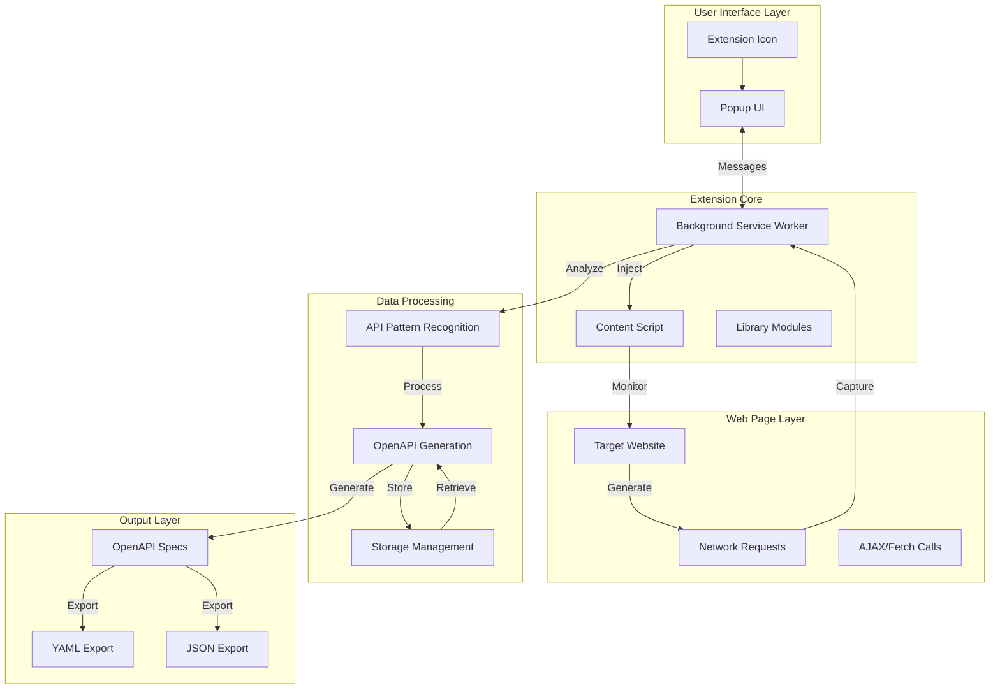
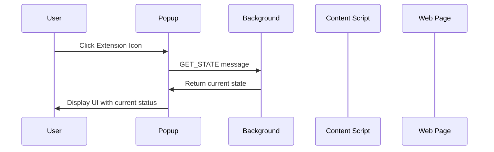
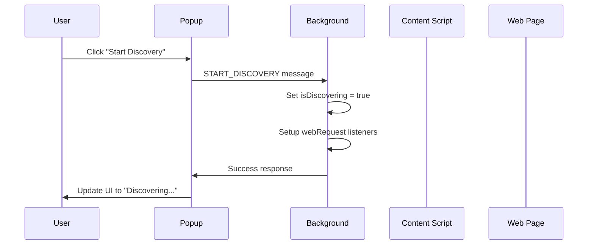
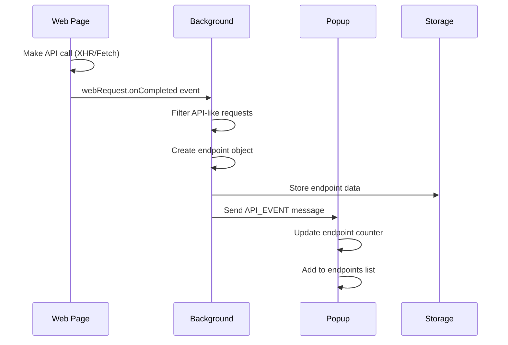
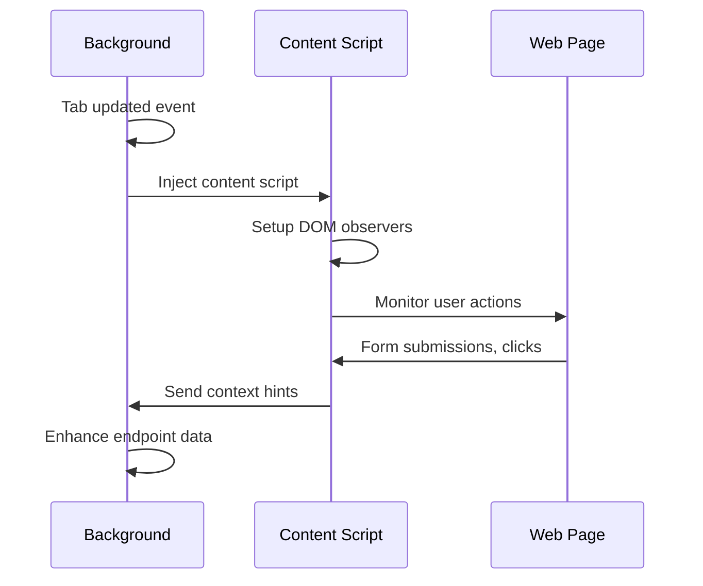
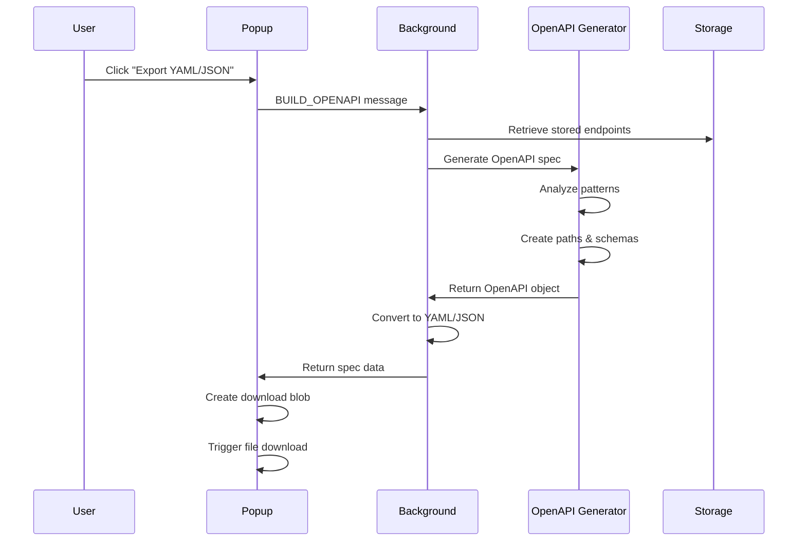
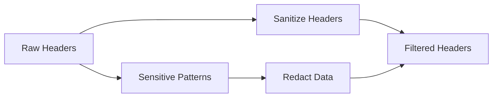
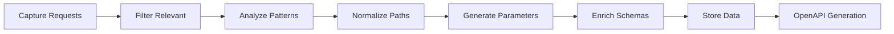
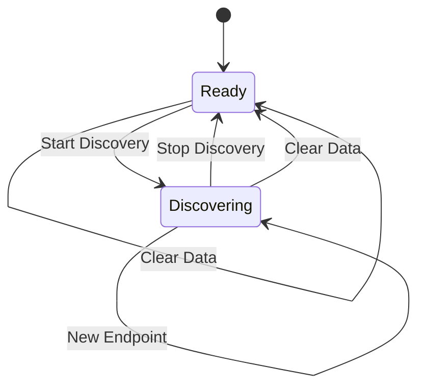

# 🏗️ Chrome Extension API Discovery - High-Level Architecture

## 📋 Overview

This document provides a comprehensive architectural overview of the Chrome Extension for API Discovery, explaining the complete flow from user interaction to OpenAPI specification generation.

## 🎯 System Purpose

The extension automatically discovers hidden APIs on any website by monitoring network traffic, analyzing patterns, and generating OpenAPI 3.0+ specifications that can be exported and used in development tools.

## 🏛️ High-Level Architecture

## 🔄 Complete Data Flow

### 1. **Initialization Phase**

### 2. **Discovery Activation**

### 3. **API Detection Flow**

### 4. **Content Script Integration**

### 5. **OpenAPI Generation**

## 🧩 Component Architecture

### **1. Popup UI (`popup/`)**

- **Purpose**: User interface for controlling discovery and viewing results
- **Components**:
  - Start/Stop discovery controls
  - Real-time endpoint counter
  - Discovered endpoints list
  - Export buttons (YAML/JSON)
  - Clear data functionality

### **2. Background Service Worker (`background/background.js`)**

- **Purpose**: Core extension logic and network monitoring
- **Responsibilities**:
  - Message handling between components
  - Web request monitoring
  - Content script injection
  - State management
  - OpenAPI orchestration

### **3. Content Script (`content/content.js`)**

- **Purpose**: Page-level interaction and context gathering
- **Capabilities**:
  - DOM event monitoring
  - Form submission tracking
  - User action observation
  - Context hint generation

### **4. Library Modules (`lib/`)**

- **`api-analyzer.js`**: Pattern recognition and endpoint analysis
- **`openapi-generator.js`**: OpenAPI specification generation
- **`utils.js`**: Common utility functions

## 🔐 Security Architecture

### **Data Sanitization**

### **Privacy Protection**

- **Header Redaction**: Authorization, cookies, tokens → `[REDACTED]`
- **PII Filtering**: Emails, phone numbers, IPs → sanitized
- **Local Storage**: Data lives only in browser storage
- **No External Transmission**: All processing is local

## 📊 Data Flow Architecture

### **Input Data Sources**

1. **Network Requests**: HTTP(S) calls captured via `webRequest` API
2. **User Actions**: Form submissions, clicks, navigation via content script
3. **Page Context**: DOM structure, script analysis via content script

### **Data Processing Pipeline**

### **Output Data Formats**

1. **YAML**: Human-readable OpenAPI specification
2. **JSON**: Machine-readable OpenAPI specification
3. **Metadata**: Discovery statistics and patterns

## 🔄 State Management

### **Persistent State**

- **`isDiscovering`**: Current discovery status
- **`endpoints`**: Array of discovered API endpoints
- **`lastSeen`**: Timestamp of last endpoint update

### **State Flow**

## 🚀 Performance Architecture

### **Optimization Strategies**

1. **Debounced Updates**: UI updates are throttled to prevent excessive rendering
2. **Lazy Loading**: Endpoints are loaded on-demand
3. **Efficient Storage**: Minimal data storage with smart deduplication
4. **Background Processing**: Heavy operations run in background worker

### **Resource Management**

- **Memory**: Efficient endpoint object structure
- **Storage**: Chrome storage API with size limits
- **CPU**: Minimal processing during request capture

## 🔌 Integration Points

### **External APIs**

- **Chrome Extensions API**: `webRequest`, `storage`, `scripting`
- **OpenAPI 3.0+**: Specification compliance
- **File System**: Download and export capabilities

### **Development Tools**

- **Swagger Editor**: OpenAPI validation
- **Postman**: API testing
- **Jentic**: API documentation platform

## 🧪 Testing Architecture

### **Test Components**

1. **`test-demo.html`**: Comprehensive API call testing
2. **Mock Endpoints**: Various HTTP methods and patterns
3. **Edge Cases**: Error responses, authentication, pagination

### **Validation Points**

- **Extension Loading**: Chrome extension compatibility
- **API Detection**: Network request capture accuracy
- **OpenAPI Generation**: Specification validity
- **Export Functionality**: File download and format

## 📈 Scalability Considerations

### **Current Limitations**

- **Single Tab Focus**: Content script per tab
- **Memory Constraints**: Browser storage limits
- **Processing**: Synchronous OpenAPI generation

### **Future Enhancements**

- **Multi-Tab Support**: Cross-tab endpoint correlation
- **Cloud Storage**: Remote endpoint storage
- **Batch Processing**: Large endpoint set handling
- **Real-time Collaboration**: Shared discovery sessions

## 🔧 Deployment Architecture

### **Extension Distribution**

1. **Developer Mode**: Local development and testing
2. **Chrome Web Store**: Public distribution (future)
3. **Enterprise**: Internal distribution via policies

### **Update Strategy**

- **Manifest Version**: V3 compatibility
- **Service Worker**: Background update handling
- **Content Scripts**: Dynamic injection and updates

## 📚 Documentation Architecture

### **Documentation Layers**

1. **`README.md`**: Project overview and quickstart
2. **`INSTALL.md`**: Installation and testing guide
3. **`ARCHITECTURE.md`**: This technical architecture document
4. **Code Comments**: Inline documentation and examples

### **User Experience**

- **Beginner Friendly**: Step-by-step instructions
- **Developer Focused**: Technical implementation details
- **Visual Aids**: Mermaid diagrams and examples

---

## 🎯 Architecture Summary

The Chrome Extension API Discovery system follows a **layered architecture** with clear separation of concerns:

- **UI Layer**: User interaction and result display
- **Core Layer**: Business logic and data processing
- **Integration Layer**: Chrome APIs and external tools
- **Data Layer**: Storage and state management

The system is designed for **extensibility**, **security**, and **performance**, providing a robust foundation for API discovery and OpenAPI generation while maintaining user privacy and data integrity.

**Key Architectural Principles:**

- ✅ **Separation of Concerns**: Clear component boundaries
- ✅ **Security First**: Data sanitization and privacy protection
- ✅ **Performance Optimized**: Efficient processing and storage
- ✅ **Extensible Design**: Modular architecture for future enhancements
- ✅ **User Experience**: Intuitive interface and clear feedback
