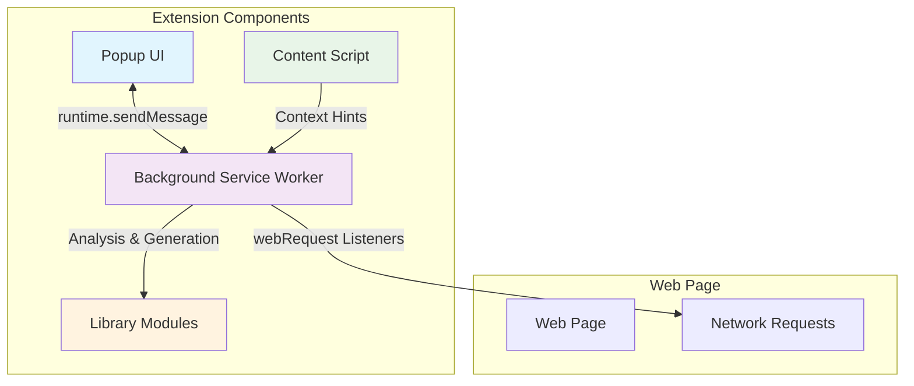
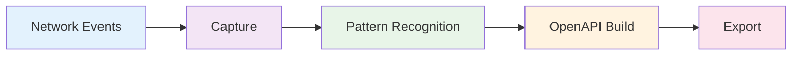

# API Discovery: HARless

[](https://developer.chrome.com/docs/extensions/mv3/)
[](https://developer.chrome.com/docs/extensions/mv3/service_workers/)
[](https://www.google.com/chrome/)
[](https://opensource.org/licenses/MIT)

> **Track 08 – Chrome Extension for API Discovery (Manifest V3)**

A browser extension that automatically discovers and generates OpenAPI specifications from any website by analyzing network traffic and API calls.

**Time Estimate:** 4–6 hours  
**Difficulty:** Beginner → Intermediate  
**Perfect for:** Web developers interested in browser APIs, reverse engineering, and making hidden APIs discoverable.

## 🎯 Outcome

- Monitors network requests on any website
- Identifies API patterns from HTTP traffic
- Generates OpenAPI 3.0+ specifications automatically (JSON/YAML)
- Exports results for Jentic and other tools
- Simple popup UI to start/stop discovery and export

## ✅ Acceptance Criteria

- [ ] Loads as MV3 extension on Chrome (126+)
- [ ] Captures and lists API-like requests (XHR/fetch) with method, path, status
- [ ] Infers endpoints + parameters and groups by base URL
- [ ] Generates valid OpenAPI 3.0+ (JSON/YAML)
- [ ] Exports files via download with correct MIME type
- [ ] Redacts secrets/PII before storage/export
- [ ] Clear "Start/Stop Discovery", "Export", "Clear Data" buttons
- [ ] README quickstart works end-to-end

## 📋 Table of Contents

- [Overview](#overview)
- [Architecture](#architecture)
- [Quickstart](#quickstart)
- [Development](#development)
- [Testing](#testing)
- [Usage Guide](#usage-guide)
- [OpenAPI Generation](#openapi-generation)
- [Export & Integration](#export--integration)
- [Security & Privacy](#security--privacy)
- [Troubleshooting](#troubleshooting)
- [FAQ](#faq)
- [Roadmap](#roadmap)
- [Contributing](#contributing)
- [License](#license)

## 🏗️ Repository Structure

```
chrome-api-discovery/
├── manifest.json
├── icons/
│   ├── icon16.png
│   ├── icon48.png
│   └── icon128.png
├── popup/
│   ├── popup.html
│   ├── popup.js
│   └── popup.css
├── background/
│   └── background.js
├── content/
│   └── content.js
├── lib/
│   ├── api-analyzer.js
│   ├── openapi-generator.js
│   └── utils.js
└── README.md
```

## 🏛️ Architecture

### Component Communication



### Data Flow



## 🚀 Quickstart

1. **Clone the repository**

   ```bash
   git clone https://github.com/yourusername/chrome-api-discovery.git
   cd chrome-api-discovery
   ```

2. **Load the extension**

   - Open Chrome and navigate to `chrome://extensions/`
   - Enable **Developer mode** (toggle in top right)
   - Click **Load unpacked** and select the `chrome-api-discovery/` folder

3. **Start discovering APIs**
   - Click the extension icon in your toolbar
   - Click **Start Discovery** in the popup
   - Browse any website with API calls (see recommended sites below)
   - Watch the endpoint counter increase
   - Click **Export** to download OpenAPI specs

## 🔧 Development

### Phase 1: Basic Extension Framework (≈90 min)

**Deliverables:**

- Loads in Chrome (MV3)
- Popup UI: Start/Stop + live counter of captured requests
- Background monitors network events and stores minimal records in `chrome.storage.local`

**Files:**

- `manifest.json`, `popup/popup.html|css|js`, `background/background.js`

**Example listener:**

```js
chrome.webRequest.onCompleted.addListener(
  (details) => {
    if (!details.url) return;
    // Heuristic: JSON/XHR/fetch only
    if (details.type !== "xmlhttprequest" && details.initiator) {
      /* keep */
    }
    chrome.runtime.sendMessage({
      type: "API_EVENT",
      url: details.url,
      method: details.method,
      status: details.statusCode,
    });
  },
  { urls: ["<all_urls>"] }
);
```

### Phase 2: API Pattern Recognition (≈120 min)

**What to detect:**

- Methods: GET/POST/PUT/DELETE/PATCH
- Path patterns: convert `/items/123` → `/items/{id}`
- Query params: collect names, sample values, infer types
- Response hints: content-type, size, status, JSON sample
- Authentication signals: `Authorization`, `Cookie`, CSRF tokens (redact)
- Group by host/base path, tag by resource

**File:**

- `lib/api-analyzer.js` (pure utilities; unit-testable)

### Phase 3: OpenAPI Generation (≈90 min)

**Output:**

- OpenAPI 3.0+ object with:
  - `info`, `servers` (dominant origin), `paths`, `components.schemas`
  - OperationIds (`getItems`, `searchItems`, etc.)
  - Parameters with inferred types
  - RequestBody / Responses with examples (sanitized)
- Export as **YAML** and **JSON**

**File:**

- `lib/openapi-generator.js`

**Example export button (popup):**

```js
document.getElementById("exportYaml").onclick = async () => {
  const spec = await chrome.runtime.sendMessage({ type: "BUILD_OPENAPI" });
  const blob = new Blob([spec.yaml], { type: "text/yaml" });
  const url = URL.createObjectURL(blob);
  chrome.downloads.download({ url, filename: "openapi.yaml", saveAs: true });
};
```

## 🧪 Testing

### Manual Checks

- [ ] Loads in Chrome without errors
- [ ] Popup opens, discovery toggles, requests appear
- [ ] Export generates non-empty YAML/JSON

### Edge Cases

- Authenticated sites (respect ToS; no credential exfiltration)
- GraphQL (treat `/graphql` as a single endpoint with `operationName` grouping)
- WebSocket (out of scope for MV3; note limitation)
- Rate limiting (listen for 429 and note in spec)

## 📖 Usage Guide

### Recommended Sites to Test

- **GitHub** (XHR API calls on repo pages)
- **Reddit** (JSON fetches)
- **News sites** (article lists)
- **E-commerce** (product search)

### Workflow

1. Load a target site
2. Press **Start Discovery** in the popup
3. Perform actions: search, paginate, open details
4. Review detected endpoints & parameters
5. **Export** OpenAPI (YAML/JSON)
6. Validate spec with an online validator or CLI

## 🔍 OpenAPI Generation Details

### Heuristics

- **Path templating rules:** UUIDs, numeric IDs
- **Query param inference:** string/number/boolean via sample set
- **Schema inference:** merge multiple samples; mark unknown as `anyOf`
- **Tags:** group by first path segment or inferred resource
- **Operation descriptions:** derived from context hints sent by content script

### Example OpenAPI Output

```yaml
openapi: 3.0.3
info:
  title: Discovered API
  version: 0.1.0
servers:
  - url: https://api.example.com
paths:
  /items:
    get:
      operationId: getItems
      tags: [items]
      parameters:
        - in: query
          name: q
          schema: { type: string }
      responses:
        "200":
          description: OK
          content:
            application/json:
              schema:
                type: array
                items: { $ref: "#/components/schemas/Item" }
components:
  schemas:
    Item:
      type: object
      properties:
        id: { type: string, example: "123" }
        title: { type: string }
```

## 📤 Export & Integration

- **Export buttons:** **YAML** and **JSON**
- **File naming:** `openapi-{hostname}-{timestamp}.yaml`
- **Jentic compatibility:** include `x-jentic-source-url` when known; ensure OpenAPI 3.0+ compliance

## 🔒 Security & Privacy

**Do not store PII or secrets.**

- Redact headers: `Authorization`, `Cookie`, `Set-Cookie`, `x-api-key`, tokens
- Redact emails/phones/IPs via regex
- Store only anonymous samples
- Data lives in `chrome.storage.local` and can be cleared in popup
- Provide a "Clear Data" button

**Example redaction before persistence:**

```js
const sanitizeHeaders = (headers) => {
  const sensitive = ["authorization", "cookie", "x-api-key", "x-csrf-token"];
  return Object.fromEntries(
    Object.entries(headers).map(([key, value]) => [
      key,
      sensitive.includes(key.toLowerCase()) ? "[REDACTED]" : value,
    ])
  );
};
```

## 🚨 Permissions

| Permission | Why it's needed                          |
| ---------- | ---------------------------------------- |
| webRequest | Monitor HTTP(S) requests and responses   |
| storage    | Persist discovered API metadata/specs    |
| activeTab  | Interact with the current page on demand |
| scripting  | Inject content script when user opts in  |

**Manifest snippet:**

```json
{
  "manifest_version": 3,
  "name": "API Discovery: HARless",
  "version": "0.1.0",
  "description": "Discover hidden APIs on any site and export OpenAPI specs.",
  "permissions": ["webRequest", "storage", "activeTab", "scripting"],
  "host_permissions": ["<all_urls>"],
  "background": { "service_worker": "background/background.js" },
  "action": { "default_popup": "popup/popup.html" },
  "icons": {
    "16": "icons/icon16.png",
    "48": "icons/icon48.png",
    "128": "icons/icon128.png"
  }
}
```

## 🛠️ Troubleshooting

- **Extension won't load** → check `chrome://extensions` errors
- **No requests captured** → ensure **Start Discovery** is on; reload target page; confirm permissions
- **Export empty** → ensure at least one JSON/XHR call happened
- **YAML invalid** → use the validator link below or `speccy`/`swagger-cli`

## ❓ FAQ

- **Does this capture response bodies?** MV3 webRequest API does not expose bodies directly; we infer schemas from metadata and observed URLs/params. Where available via page context (e.g., `content.js` hooks or app logs), we sample small, sanitized payloads.

- **Is this safe to use at work?** Respect site ToS and internal policies. This tool is for documentation/discovery only.

## 🗺️ Roadmap

- Optional DevTools Protocol integration (opt-in) for richer payload sampling
- GraphQL operation schema inference
- Batch site sessions and history
- Cloud export integrations

## 🤝 Contributing

- PRs welcome: lint, small functions, unit tests for `lib/*`
- Issue templates: bug, feature
- Code of Conduct

## 📄 License

MIT License - see [LICENSE](LICENSE) file for details.

---

## 🔗 External Links

- [Chrome Extensions (MV3) Docs](https://developer.chrome.com/docs/extensions/mv3/)
- [chrome.webRequest API](https://developer.chrome.com/docs/extensions/reference/webRequest/)
- [OpenAPI Specification](https://spec.openapis.org/oas/v3.1.0)
- [Common online OpenAPI validators](https://editor.swagger.io/)
# chrome-api-discovery

