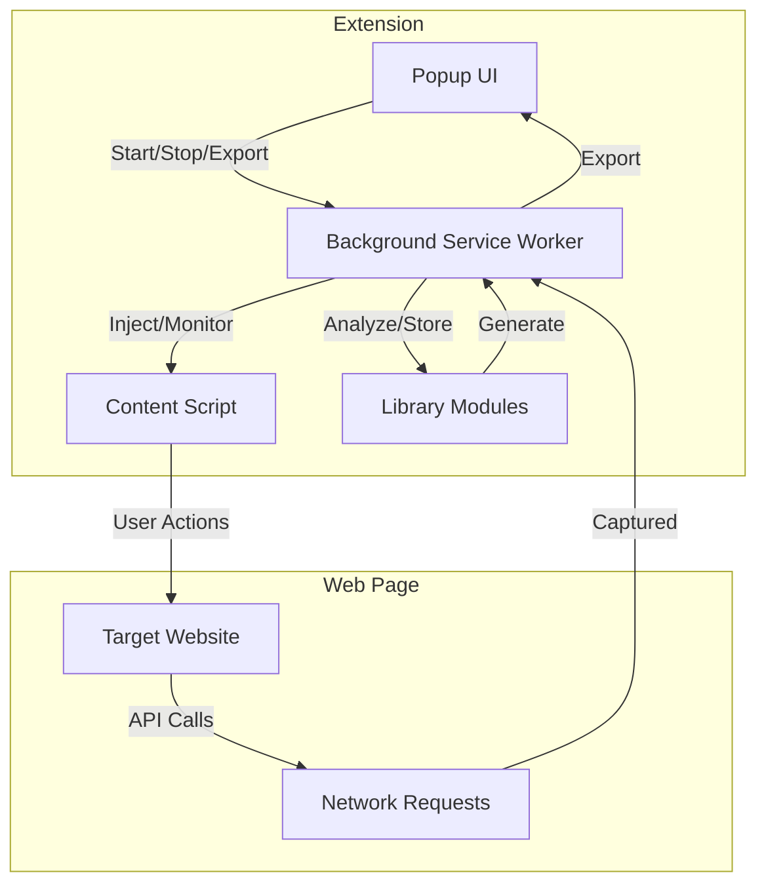

# API Discovery: HARless

[](https://developer.chrome.com/docs/extensions/mv3/)
[](https://developer.chrome.com/docs/extensions/mv3/service_workers/)
[](https://www.google.com/chrome/)
[](https://opensource.org/licenses/MIT)

> **Track 08 – Chrome Extension for API Discovery (Manifest V3)**

A browser extension that automatically discovers and generates OpenAPI specifications from any website by analyzing network traffic and API calls.

**Time Estimate:** 4–6 hours  
**Difficulty:** Beginner → Intermediate  
**Perfect for:** Web developers interested in browser APIs, reverse engineering, and making hidden APIs discoverable.

## 🎯 Outcome

- Monitors network requests on any website
- Identifies API patterns from HTTP traffic
- Generates OpenAPI 3.0+ specifications automatically (JSON/YAML)
- Exports results for Jentic and other tools
- Simple popup UI to start/stop discovery and export

## ✅ Acceptance Criteria

- [ ] Loads as MV3 extension on Chrome (126+)
- [ ] Captures and lists API-like requests (XHR/fetch) with method, path, status
- [ ] Infers endpoints + parameters and groups by base URL
- [ ] Generates valid OpenAPI 3.0+ (JSON/YAML)
- [ ] Exports files via download with correct MIME type
- [ ] Redacts secrets/PII before storage/export
- [ ] Clear "Start/Stop Discovery", "Export", "Clear Data" buttons
- [ ] README quickstart works end-to-end

## 📋 Table of Contents

- [Overview](#overview)

# 🚦 API Discovery: HARless

> **Discover, Document, and Export Hidden APIs Instantly!**

---

## 👋 Introduction

**HARless** is a Chrome extension that helps you uncover hidden APIs on any website and instantly generate OpenAPI documentation. Perfect for developers, testers, and anyone curious about how web apps communicate behind the scenes.

---

## � Key Features

- 🔍 **Automatic API Discovery**: Captures all XHR/fetch network requests as you browse
- 🧠 **Pattern Recognition**: Groups endpoints, infers parameters, and detects authentication
- 📄 **OpenAPI Generation**: Instantly creates OpenAPI 3.0+ specs (YAML/JSON)
- ⬇️ **One-Click Export**: Download your API docs for Swagger, Postman, or Jentic
- 🛡️ **Privacy First**: Sensitive data is redacted; all processing is local

---

## �️ How It Works



---

## 🚀 Live Demo (How To Use)

1. **Clone the repo:**
   ```bash
   git clone https://github.com/EdwinShibuMathew/chrome-api-discovery.git
   cd chrome-api-discovery
   ```
2. **Load in Chrome:**
   - Go to `chrome://extensions/`
   - Enable **Developer mode**
   - Click **Load unpacked** and select the folder
3. **Click the extension icon** and hit **Start Discovery**
4. **Browse any site**—watch endpoints appear in real time!
5. **Export** your OpenAPI spec with one click

---

## 🖼️ Example Use Case

> "I want to reverse-engineer a web app's API for integration or testing."

1. Start HARless and begin discovery
2. Interact with the web app (search, login, etc.)
3. See all discovered endpoints and parameters
4. Export a ready-to-use OpenAPI spec

---

## 🧪 Testing & Validation

- Try on sites like **GitHub**, **Reddit**, or your favorite news/e-commerce site
- Use [Swagger Editor](https://editor.swagger.io/) to validate your exported OpenAPI file

---

## 🔒 Security & Privacy

- Sensitive headers (tokens, cookies) are always redacted
- No data ever leaves your browser
- Use the **Clear Data** button to erase all captured info

---

## 🛠️ Troubleshooting

- **Extension won't load?** Check for errors in `chrome://extensions`
- **No requests captured?** Make sure discovery is started and reload the page
- **Export empty?** Ensure the site made at least one API call

---

## 📄 License

MIT License

---
